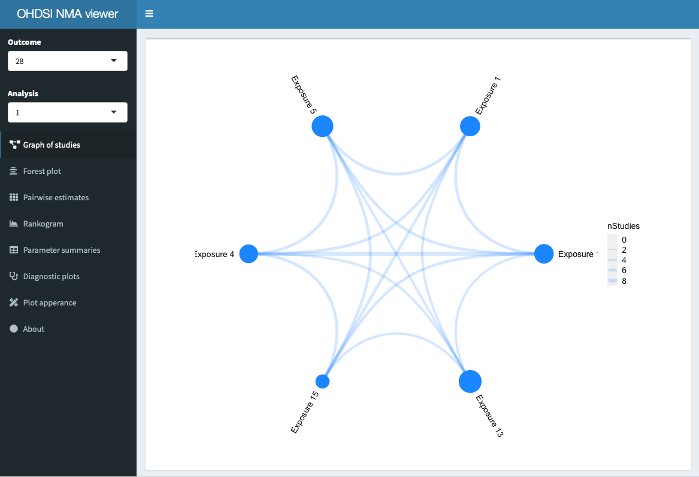

<!-- README.md is generated from README.Rmd. Please edit that file -->

```{r, include = FALSE}
knitr::opts_chunk$set(
  collapse = TRUE,
  comment = "#>",
  fig.path = "man/figures/README-",
  out.width = "100%",
  eval = FALSE
)
```

# NetworkMetaAnalysis

<!-- badges: start -->
[](https://travis-ci.org/OHDSI/NetworkMetaAnalysis)
<!-- badges: end -->

A package for using a collection of target-comparator-outcome estimates from OHDSI network studies to estimate relative effectiveness between all target-comparator pairs, even in the absence of head-to-head comparison.

## Features

- Simple interface for network meta-analyses crafted for OHDSI network studies
- Interactive Shiny app for simple exploration of results and model diagnostics
- Supports parallel processing
- Bayesian parameter estimation: allows for generating and comparing derived quantities from posterior samples
- Supports checking network consistency with node-splitting analysis (compare overall network estimates with diret and indirect estimates)

## Screenshots

#### Pair-wise HRs

Example of heatmap with hazard ratios (HRs) between all six exposures in a demo analysis, with SUCRA values in the diagonal. HRs > 1 favour exposures on the horisontal axis, HRs < 1 those on the vertial axis. SUCRA stands for surface under the cumulative ranking and is the probability that the exposure is most effective.


```{r, echo=FALSE}
# For now, saved as file -- code kept here when we have settled on whether to share data or not with package
ggplot2::update_geom_defaults("text", list(size = 10 / ggplot2::.pt))
NetworkMetaAnalysis::plotPairwiseEstimates(
	tidyEstimates = filter(results$pairwiseEstimates, networkMetaAnalysisId == 1), textSize = 10, 
	sucraEstimates = NetworkMetaAnalysis::computeSucra(filter(results$rankProbabilities, networkMetaAnalysisId == 1))) +
	labs(x = "Target exposure id", y = "Comparator exposure id")
```

#### Interactive app

The Shiny app has a classic dashboard-like structure with a menu on the left and large main panel showing appropriate content, here the graph of the six included studies. Node sizes represent the average incident of the outcome of interest in that cohort, line thickness the number of studies with direct comparisons of the two exposures connected by the lines. This graph plot is the result of `plotNetwork()`. 



## Installation

Install the package directly from GitHub using `devtools` (if you don't have, just install that first):

``` {r}
# install.packages("devtools")
devtools::install_github("OHDSI/NetworkMetaAnalysis")
```

## Example

A fully-fletched network meta-analysis can be run with a few lines of code. Here, we use pseudo-settings for a local PosgreSQL database with a sample of the LEGEND study in a decicated schema. 

```{r}
library(NetworkMetaAnalysis)
library(DatabaseConnector)

cd <- createConnectionDetails(dbms = "postgresql", user = "user", password = "password", 
							  connectionString = "jdbc:postgresql://localhost:1234/db_name")
conn <- connect(cd)

legendSample <- fetchTcoEstimates(conn, resultsCdm = "legend_nma", resultsTable = "legend_sample")

results <- runAnalyses(legendSample, nCores = 4) # uses foreach to run in parallel if nCores > 1

launchShinyApp(results)
```

#### Saving and loading results

Fitting several network meta-analysis can be quite time-consuming, so once done the user would likely save the results. The results are essentially a list with a specific structure, so the user can save to a file with R's built-in `saveRDS` function, but NetworkMetaAnalysis features two functions to save the results to and load them from a database.

```{r}
# Save to and load from database
saveToDatabase(results, conn, resultsCdm = "legend_nma", overwriteExistingTables = TRUE)
resultsFromDb <- loadFromDb(conn, resultsCdm = "legend_nma")

# Save to and load from file
saveRDS(results, file = "results_with_nodesplitting.Rdata")
resultsFromFile <- readRDS("results_with_nodesplitting.Rdata")
```

## Support

- Developer questions/comments/feedback: [OHDSI Forum](http://forums.ohdsi.org/c/developers)
- We use the [GitHub issue tracker](https://www.github.com/OHDSI/NetworkMetaAnalysis/issues) for all bugs/issues/enhancements

## Contributing

If you would like to contribute to this package, please head over to [the HADES page](https://ohdsi.github.io/Hades/contribute.html) to see how.

## License

NetworkMetaAnalysis ic licensed under Apache License 2.0.

## Development and status

NetworkMetaAnalysis is developed in RStudio. NetworkMetaAnalysis is maturing under active development.

## Acknowledgements

- The package maintainer received funding from Innovation Fund Denmark (5153-00002B) and the Novo Nordisk Foundation (NNF14CC0001).

